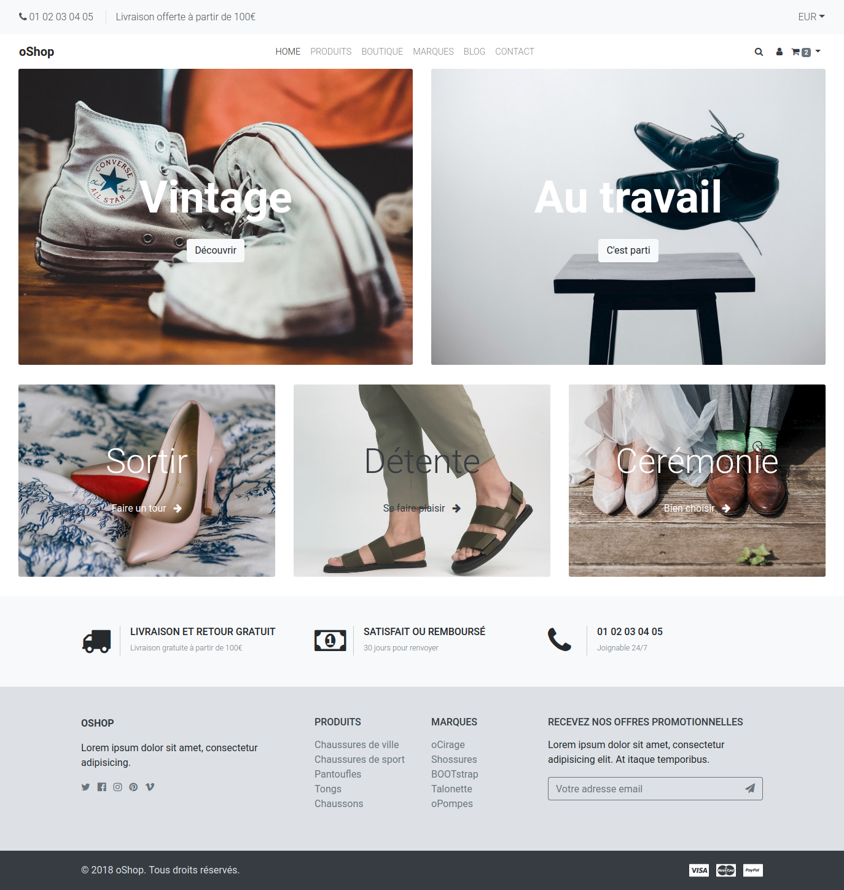
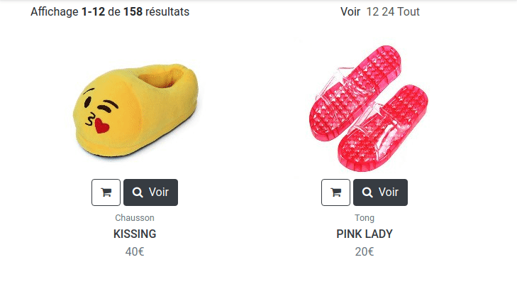
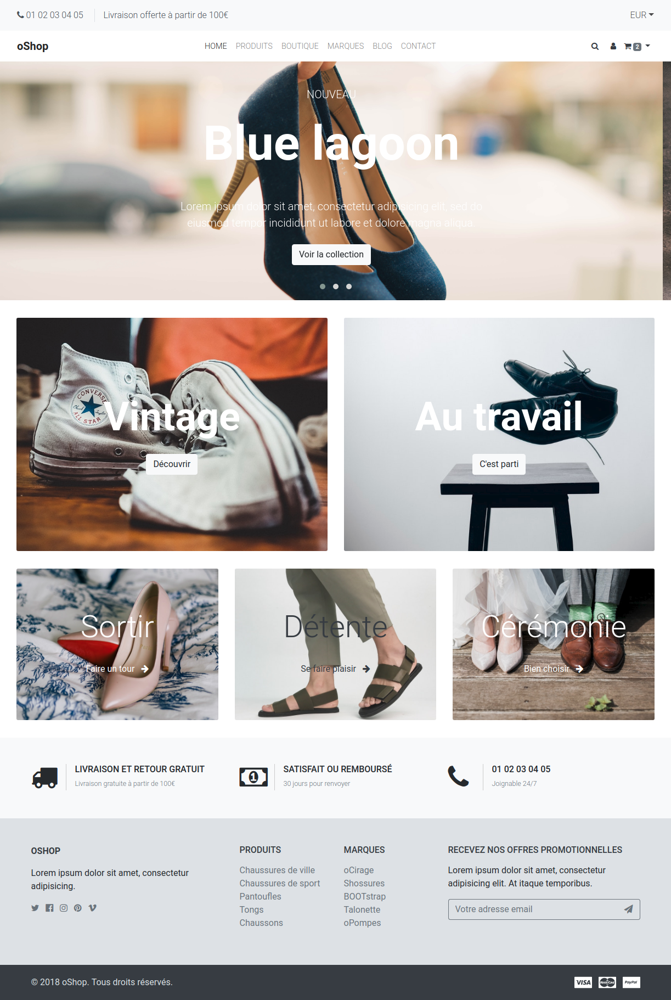

# oShop - Dans les shoe

En voila une boutique séduisante :yum:

Oui mais... c'est à vous de l'intégrer :scream:

Pas de panique, un outil est là pour vous y aider. Bootstrap :sunglasses:

Dans le dossier `resultat/` quelques captures sont présentes

## Travail d'équipe

- Maintenant qu'on a vu les git _Pull Requests_, vous pouvez travailler à plusieurs et en parallèle sur le même dépôt
- donc, vous avez le choix entre _PairProgramming_ et programmer chacun de son côté
- nous vous conseillons fortement de faire au moins **les 2 premières étapes en PairProgramming**

## Instructions

### Etape 1 - Layout

- analyser les zones qui se répètent d'une page à l'autre (répertoire `resultat`)
- commencer par l'intégration HTML/CSS de ces "zones" / ce "gabarit" / ce "layout"
- on laisse le contenu spécifique à chaque page pour plus tard

### Etape 2 - Templates / Views

- une fois le "layout" mis en place, on va le mettre en place dans notre projet _oShop_
- les fichiers CSS, images et JavaScript sont à placer dans le répertoire `public/assets/` (puis un des sous-répertoires)
    - il faudra certainement ensuite modifier les liens (**URLs**) vers ces fichiers
- ensuite, pour le layout, vous aurez besoin de créer les _views_ "header" et "footer" :wink:
- quite à avoir "header" & "footer", autant utiliser notre classe _Templator_ dans ce projet :bulb:
    - récupérer le fichier de la classe _Templator_ de la saison précédente
    - le placer dans le répertoire `app/Utils/`
    - ne pas oublier de l'inclure :nerd_face:
    - et ne pas oublier de l'utiliser :joy:

### Etape 3 - Home

- faire l'intégration HTML/CSS de la page d'accueil directement dans le projet

### Etape 4 - Catégorie

- faire l'intégration HTML/CSS de la page catégorie (liste de produits) directement dans le projet

### Bonus

- faire l'intégration HTML/CSS des autres pages, directement dans le projet

### Bonus Fioritures :lipstick:

#### ... fun

et si on animait un peu cette interface. Dans la partie catégorie on pourrait légèrement modifier la présentation de nos produits 

#### ... qui pique

Si nous ajoutions un sélecteur de devise et un résumé du panier sur TOUTES les pages de la boutique ?

#### ... de la mort

Pourquoi ne pas ajouter un carousel à cette page d'accueil ?

Cet [outil](https://owlcarousel2.github.io/OwlCarousel2/) semble très adapté :+1:

